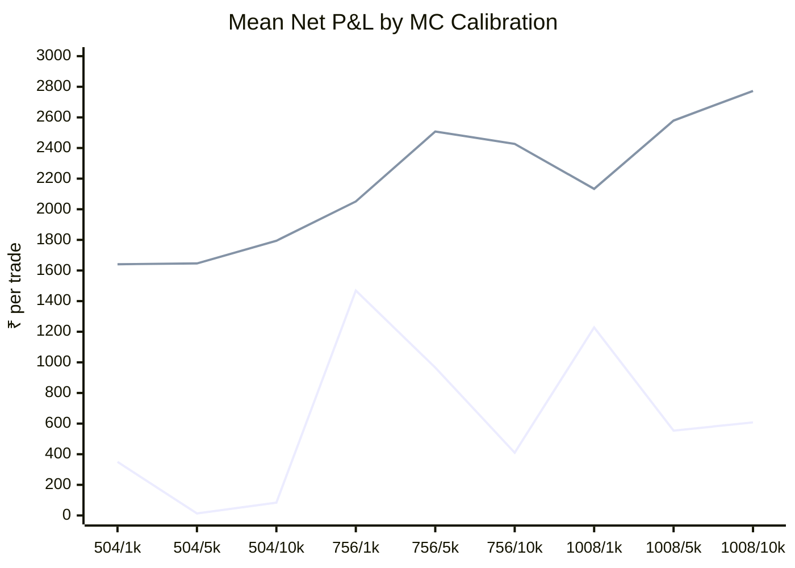
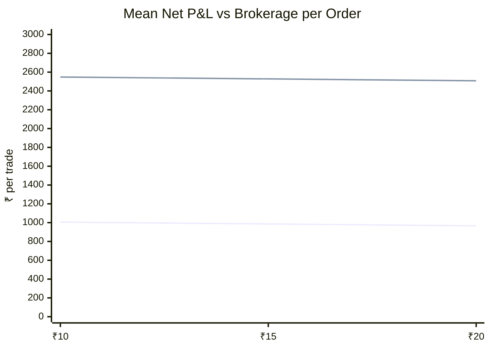

# Publication Figures and Charts — Version 1.0

## Figure 1 — Mean net P&L across MC calibration settings

First line: NIFTY. Second line: SENSEX.

## Figure 2 — Mean P&L versus conservative research capital

```mermaid
xychart-beta
    title "Mean Net P&L and Conservative Research Capital"
    x-axis ["NIFTY","SENSEX"]
    y-axis "₹" 0 --> 70000
    bar [966,2508]
    bar [63508,66886]
```

First bar series: mean net P&L/trade. Second bar series: conservative research capital proxy.

## Figure 3 — Brokerage sensitivity

First line: NIFTY. Second line: SENSEX.

## Figure 4 — Tail-risk summary

| Measure | NIFTY | SENSEX |
|---|---:|---:|
| ES95 loss | ₹31,753.75 | ₹26,807.30 |
| ES99 loss | ₹38,992.43 | ₹38,352.77 |
| Maximum drawdown | ₹61,576.41 | ₹66,886.42 |
| Conservative capital proxy | ₹63,507.51 | ₹66,886.42 |