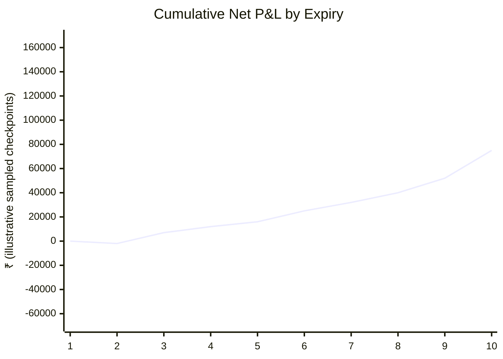
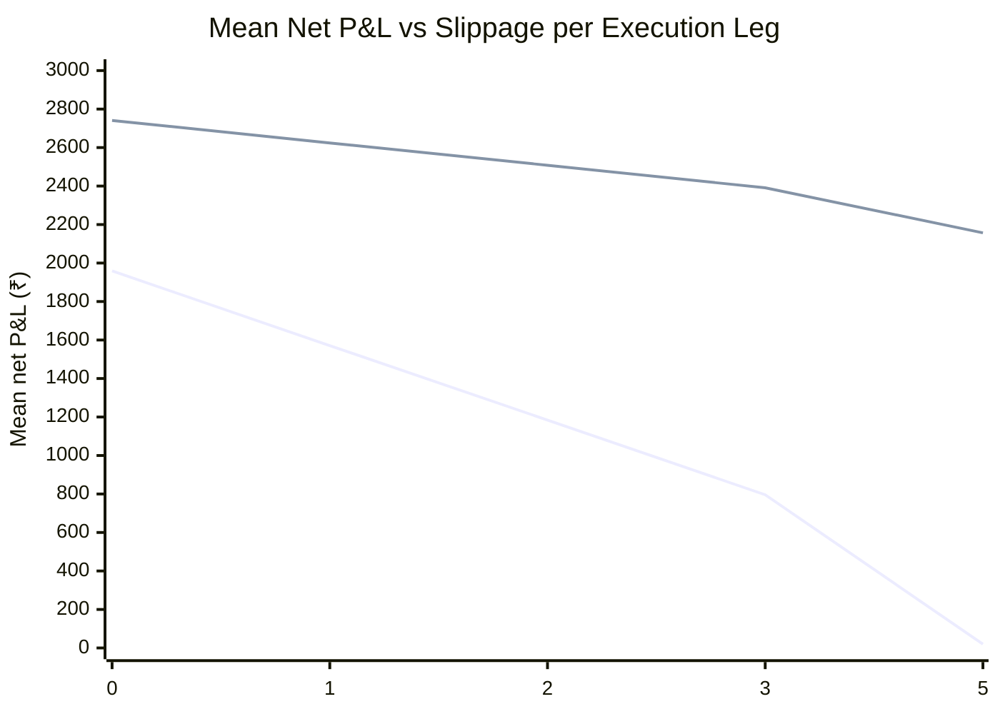

# Manuscript Figures and Charts

## Figure 1 — Cumulative net P&L by expiry

The primary trade sequences are ordered chronologically by expiry.

**Caption:** The final manuscript should treat the chronological trade P&L path as descriptive. The plotted checkpoints are a compact visualization of the cumulative trajectory; the exact trade-level values remain in the GitHub Actions artifact.

## Figure 2 — Mean net P&L versus slippage

First line: NIFTY. Second line: SENSEX.

## Figure 3 — Mean net P&L by calendar year

```mermaid
xychart-beta
    title "Mean Net P&L by Calendar Year"
    x-axis ["2024", "2025", "2026*"]
    y-axis "Mean net P&L (₹)" -1500 --> 6500
    bar [-614, 894, 2106]
    bar [-1130, 852, 6019]
```

First bar series: NIFTY. Second bar series: SENSEX.

## Figure 4 — Trade-level distribution

The corresponding distribution should be read together with:
- NIFTY SD: ₹10,918
- SENSEX SD: ₹11,114
- NIFTY ES95: -₹30,890
- SENSEX ES95: -₹26,807
- NIFTY ES99: -₹38,992
- SENSEX ES99: -₹38,353

**Charting note:** Mermaid charts are used as lightweight, repository-native figures because binary image upload is not required for reproducibility. All source values are committed as CSV tables.
